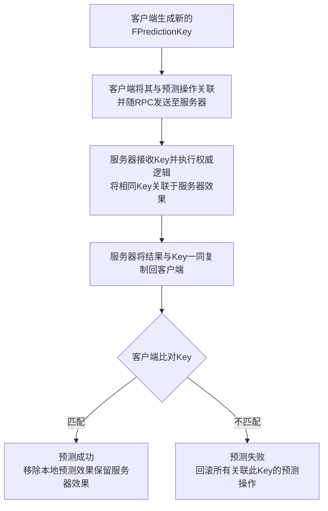

# GAS系统的预测

预测为了解决什么问题：

UE的网络结构里面，服务器的权威的，客户端默认是不被信任的。

一个按键触发的技能，玩家的按键操作一定是在客户端本地进行的。理想情况下，按键操作需要发送到服务器，服务器校验过，合法然后通知客户端，客户端才实际触发技能的逻辑（等待时间为一次RTT）。但是网络环境是不可控的，这种方法会导致操作有延迟，游戏过程不流畅，游戏体验差。


预测是什么：简单来讲，就是假设玩家的操作是合法的。玩家按键操作，立即触发技能逻辑并且往服务器发送此次触发技能的请求（客户端预测）。等服务器收到请求，这个时候去校验合法性，然后向客户端发送成功或者失败的消息。如果成功，客户端继续执行当前技能，如果失败，就撤销技能激活（服务器校验，矫正）

那么服务器和客户端怎么知道，某次技能激活跟两个端预测或校验的是同一个技能同一次触发呢？

## 一，FPredictionKey（预测Key）。


[GAS](https://zhida.zhihu.com/search?content_id=254758971&content_type=Article&match_order=1&q=GAS&zhida_source=entity)里用了一个FPredictionKey来标识客户端和服务器的同一个技能的同一次触发。本质上，这个Key就是个int16，服务器和客户端通过这个Key来标识同一个技能的同一次触发。

核心流程：客户端在预测激活GA的时候会生成一个预测Key，在触发本地GA的逻辑的同时把激活GA的操作和这个Key一起发送到服务器。服务器收到激活GA的请求，校验之后就会用这个Key去通知客户端成功与否。

注意：每次激活GA（即使是同一个GA），Key都是重新生成的。生成的方式就是全局的int16加1。

本地预测的GA，只有客户端（严格来讲是主控端）能生成预测Key。


KeyTyp就是int16的别名，在FPredictionKey开始有声明

GAS相关的系统的预测相关操作都是通过绑定的预测Key的代理，比如预测失败的代理，Montage绑定的实现就是StopMontage，GE的实现就是RemoveGE，GC就是RemoveGC等等，当然如果是自己生成的Actor也可以通过这种方式绑定回调，以实现可预测的Actor等等。

## 二，GA([GameplayAbility](https://zhida.zhihu.com/search?content_id=254758971&content_type=Article&match_order=1&q=GameplayAbility&zhida_source=entity))的预测。

首先本地预测的GA，即在NetExecutionPolicy配置项设置为LocalPredicted，才会生效。


了解了预测Key，以及他的作用。接下来的问题就是，，GAS里预测是怎么发生的。

（注意，为了关注GA预测的流程，文章会故意忽略把一些代码）

### **客户端：**

我们以TryActivateAbilityByClass作为入口，模拟一次按键激活本地预测的GA开始梳理：


按键触发TryActivateAbilityByClass后，通过GA的class找到对应的FGameplayAbilitySpec去触发GA，

TryActivateAbility里面主要是判断一些数据的有效性，如果在激活GA时勾选了远程激活，则会帮我们处理远程调用激活GA的操作。这里就不细讲，我们主要关心预测的流程。

接下来会走到较为核心的InternalTryActivateAbility（这个函数是实际出发GA的实现，内部分别处理了客户端和服务器GA的激活）：

首先判断CanActive，如果失败直接返回，既不开始预测，也不响服务器发送信息。


如果判断通过，则开始创建预测窗口，发送服务器信息，正式激活客户端GA。


当判断GA的NetExecutionPolicy是LocalPredicted而且我们是主控端时，会申明一个[FScopedPredictionWindow](https://zhida.zhihu.com/search?content_id=254758971&content_type=Article&match_order=1&q=FScopedPredictionWindow&zhida_source=entity)类型的局部变量，即GA的预测窗口。


通过构造函数我们看出，先是把当前预测Key保存在RestoreKey里，然后新生成一个预测Key，此处调用的是GenerateDependentPredictionKey（为什么这样后面讲）


然后将激活的GAHandle（Handle是个int32，每个GAGive的时候会生成一个，服务器跟客户端是一致的，作用类似于NetGUID。用来查找实际储存GA信息的FGameplayAbilitySpec）和这个新的预测Key一起通过RPC发送到服务器上(CallServerTryActivateAbility->ServerTryActivateAbility)，绑定预测Key的CaughtUp，然后立即触发客户端的GA逻辑。


handle的值也是全局整形+1.


到这里，客户端激活预测GA的流程就结束了。

### **服务器：**

那么接下来讲服务器的流程，上面讲到，客户端通过CallServerTryActivateAbility调用ServerTryActivateAbility这个RPC讲激活信息和预测Key发送到了服务器。

ServerTryActivateAbility->InternalServerTryActivateAbility


在InternalServerActiveateAbility内部，利用客户端发上来的预测Key，构建一个预测窗口。根据参数可知具体的构造函数。


同样将当前的预测Key存到Restore里面，然后把新的预测key设置为当前的预测Key。

在预测窗口创建后，尝试调用InternalTryActivateAbility。


如果激活成功，会调用ClientActivateAbilitySucceed的RPC，告诉客户端，这个GA的激活成功，表明此次预测是成功的，合法的。

如果InternalTryActivateAbility这个函数返回false，则表示这次激活是不被服务器状态允许的，则调用ClientActivateAbilityFailed这个客端的PRC，通知客户端失败，并且广播这个预测Key的回滚事件，确保预测的效果移除。


ClientActivateAbilityFailed实现也非常简单，就是EndAbility。

这么看来，服务器的流程很简单，收到消息，找到对应的GA，创建预测窗口，尝试调用InternalTryActivateAbility激活GA，然后通知客户端成功与否。

### FScopedPredictionWindow

预测流程走完了，但是似乎还缺点什么，FScopedPredictionWindow的操作在哪里？申明了局部变量就没有下文了？当然不是，看FScopedPredictionWindow这个类的析构函数我们可以明确看到


FScopedPredictionWindow即预测窗口在析构时，会把当前的预测Key（存在ASCComponent上的一个FPredictionKey变量）设置成RestoreKey。

*局部变量在函数调用完成后，生命周期就结束了。所以InternalTryActivateAbility调用完成之后预测窗口也会跟着析构，对于本次GA内的预测就失效了（因为当前预测Key已经被设置回了上一个（也许不是有效的），GA再用当前Key绑定任何预测的代理都是错误的）。进而我们可以简单理解，预测窗口的有效期仅仅是在窗口创建后，激活GA的这一帧内。所以在编写GA内部逻辑时，大部分异步节点的回调操作，预测是失效的（比如Delay之后Apply的GE）。异步节点想有预测的话可以参考官方的WaitNetSync的Task节点，重新生成预测窗口，用新的预测Key建立客户端预测。*

### **FPredictionKey的Base和Current以GA预测依赖链**

上面我们只讲了激活一个GA的预测流程，那要是GA1的预测窗口期内激活了GA2这个时候怎么办？

按通常思路来讲，GA2也算是GA1的其中一个“附带效果”，我们用GA2的回滚逻辑绑到GA1预测Key上不就解决了。GA2的预测窗口期内又触发了GA3呢？

GA1触发了GA2，GA2触发了GA3，如果GA2和GA3都用GA1的预测Key生成预测窗口，那么只要GA1失败，那么2和3一样被回滚。

但是万一GA1预测成功了，GA2却预测失败了，如果按刚才的方法，这个时候GA3并不会被回滚，还会执行下去，这个时候客户端就错了。这是不允许发生的。


所以GAS在FPredictionKey里，刚才提到的Base和Current，Base表示原始键值，比如

刚才的例子，GA2和GA3创建的预测窗口FPredictionKey的Base值就是GA1预测Key的Current值。

AddDependency


UE的标注是在依赖链中的原始键，GA1-&gt;GA2-&gt;GA3可以看做一个依赖链


可以看到，预测窗口的key都是通过GASComponent的ScopedPredictionKey生成的，即当前key（当前key可以无效，无效则证明此次GA不是在别的预测窗口里激活的，即原始键值，第一个激活的GA），如果Previous>0,即在生成新的预测Key之前，已经有有效的预测窗口，所以我们需要FPredictionKeyDelegates::AddDependency里面将此次新生成的预测Key的代理绑到上一个预测key的代理上。


拿之前例子来说，GA2绑GA1，GA3绑GA2。
GA2预测失败，GA2和GA3一起回滚；

GA1预测失败，GA1，GA2和GA3一起回滚；

这样就解决了多依赖的问题。我愿称之为GAS系统版的人体蜈蚣！！！只要上一个不拉，后面链接的都得饿死。

## 三，[GameplayEffect](https://zhida.zhihu.com/search?content_id=254758971&content_type=Article&match_order=1&q=GameplayEffect&zhida_source=entity)的预测

同样，GE的预测我们从GA里面ApplyGE的入口ApplyGameplayEffectSpecToOwner开始：

函数开始就判断了Network Authority和有无有效的预测Key，从HasAuthorityOrPredictionKey实现可以得出，只有在权威端和有有效预测窗口（即有效预测Key）的情况下，GE才会执行Apply的流程（包括后面的Apply流程都会校验这个判断）。


不管是ApplyToTarget还是ApplyToSelf,最最终都是走的Apply的目标身上AbilitysystemComponent的ApplyGameplayEffectSpecToSelf，函数开头同样判断了是否是权威端或是否可预测。


有触发间隔类型的GE对Attribute的修改是瞬时的也就是无法撤销，而且是多次的修改。其修改的方式跟Instant类型的GE是一致的。不过需要提醒的是虽然对Attribute的修改方式是一致的，但是Instant类型的GE是可以预测的。

但是Instant类型是GE是可预测的，在预测的流程里面，Instant类型的GE在客户端被视为永久的，等预测Key同步的时候，客户端的这个预测GE会被移除。


bTreatAsInfiniteDuration的意思为，在客户端（主控端）且有有效预测Key，GE的类型是Instant，所以这种情况Instant的GE也会正常走Apply的流程


对于服务器，Instant类型的GE不会有生命周期，会直接触发属性的修改

其他GEApply的流程先忽略，我们只关注预测相关的，在FActiveGameplayEffectsContainer的ApplyGameplayEffectSpec里面，客户端在完成Apply之后，


绑定预测Key的CaughtUp和Reject回调，以保在服务器拒绝这次预测或者服务器成功执行后，移除客户端的GE

## 四，其他预测实现

### GAS的MontageTask：

GAS的Montage接口是UAbilitySystemComponent::PlayMontage，包括了预测Montage的播放，同步到模拟端的处理，预测的实现很简单，也是本地先Play，然后绑定预测key的回调，如果回滚就Stop当前绑定的Montage.


绑定预测key的回滚事件，OnPredictiveMontageRejected的实现很简单，就是Stopmontage。

### 扩展思考：

可预测的Actor生成：

到目前位置，我们已经了解预测是怎样的一个流程，那么将Actor的生成也纳入预测的机制里也顺水推舟。

只要在预测窗口内，actor生成的时候将Destroy的事件绑定到预测key的回滚回调上，这样预测失败的时候附带生成的Actor也能被正常destroy。

但是我们要明确一件事：本地预测的GA只会在主控端和服务器运行。简单将Actor纳入GA的本地预测可预见的有两个问题：

1，如果Actor不是复制的，那么模拟端就不会看见这个Actor，这样对联机游戏还是不能接受的。

2，如果Actor是复制的，模拟端确实可以看见从服务器生成，然后同步下来的Actor，但是主控端会看见两个相同的Actor（一个是主控端预测生成的，一个是服务器生成然后同步的）。

那么有两种方案供参考：

一，

预测的Actor是复制的。当服务器生成的Actor同步到客户端，并且根据同步的数据新生成对象的时候，我们将客户端预测生成的这个Actor桥接到新开启的这个同步的Actor的Channel上。

具体可参考：Actor的网络同步流程。PackageMapClient的SerializeNewActor以及NetGUID的实现。

这种做法要改动一点引擎代码才能实现。
好处是：可以无缝衔接，不会有两个相同的Actor在主控端出现，模拟端也能知晓这个Actor的生成。还能保持服务器权威的状态，即使有数据更新，主控端Actor也不会受影响。

二，

预测的Actor是复制的。在客户端新增一个Manager，维护一个预测的Actor表，在服务器同步预测Actor到主控端时，这个Actor对象用于校验预测Actor，作为这个Actor的”实体“隐藏在World中。相当于主控端还是有两个预测生成的Actor（一个是主控端预测生成的，一个是服务器生成然后同步的）。只不过服务器同步下来的这个Actor不可见。实际驱动主控端这个Actor运行。


好处：不用改动引擎，只需要管理自己的Manager即可实现。

坏处：必须得为这个主控端生成的Actor转发数据更新。实际实现起来比较繁琐。当然在服务器生成的Actor同步到客户端的时候去销毁主控端预测生成的Actor不行吗，这样既能保证只有一个主控端只有Actor，也不用转发数据更新，当然可以。但是服务器生成的Actor同步到客户端的时候，往往主控端的actor已经预表现了一段时间了，如果直接销毁，可能会导致游戏体验有割裂感，甚至BUG。总之还是有很多不确定性。


了解UE5的GAS（GameplayAbilitySystem）中的预测（Prediction）机制，对于制作流畅的多人游戏体验至关重要。它能减少网络延迟带来的操作滞后感，让玩家感觉更加即时响应。下面我将为你梳理GAS预测的核心概念、FPredictionKey的作用、GameplayAbility (GA) 和 GameplayEffect (GE) 的预测，以及其他相关的预测实现。

我会先用一个表格帮你快速梳理GAS中各类操作的预测支持情况：

| 预测对象                     | 是否支持预测   | 备注与说明                                                   |
| :--------------------------- | :------------- | :----------------------------------------------------------- |
| **Ability激活**              | ✅ **支持**     | 客户端可预测性激活技能，无需等待服务器确认。                 |
| **触发事件 (Trigger Event)** | ✅ **支持**     | 与Ability激活相关的事件可预测。                              |
| **GameplayEffect应用**       | ✅ **支持**     | 客户端可预测性地应用GE（包括属性修改、Tag修改）。            |
| **Attribute修改**            | ✅ **支持**     | **例外**：通过`Execution`进行的属性计算**无法预测**，只有通过`Modifier`方式的属性修改可以预测。 |
| **GameplayTag修改**          | ✅ **支持**     | 伴随GE的应用或移除而预测。                                   |
| **GameplayCue事件**          | ✅ **支持**     | 支持预测性触发（先播后判），服务器否决则会自动终止/回滚。    |
| **播放蒙太奇 (Montage)**     | ✅ **支持**     | 客户端可预测性播放动画，ASC有内置的Montage同步RPC。          |
| **移动 (Movement)**          | ✅ **支持**     | 基于UE的`UCharacterMovement`组件，支持预测。                 |
| **GameplayEffect移除**       | ❌ **不支持**   | 无法预测GE的移除。                                           |
| **GameplayEffect周期效果**   | ❌ **不支持**   | 无法预测周期性生效的效果（如DOT伤害）。                      |
| **冷却时间 (Cooldown)**      | ⚠️ **部分支持** | 本身基于GE，故移除无法预测。高延迟玩家可能实际冷却时间更长。 |

### 🔑 FPredictionKey（预测键）

`FPredictionKey`（预测键）是GAS预测机制的**核心枢纽**。它是一个在客户端生成的唯一整数ID，用于关联和追踪一次预测性操作（如激活技能、应用效果）所产生的一系列副作用（Side Effects）。

其工作流程简要概括如下：


值得注意的是，`FPredictionKey`**总是从客户端复制到服务器**，但当从服务器复制回客户端时，**它只会复制回最初生成该Key的客户端**，其他客户端收到的会是无效的（0）Key。

### ⚔️ HasAuthorityOrPredictionKey 函数

`HasAuthorityOrPredictionKey` 是一个常用于条件判断的工具函数，它检查当前是否**拥有权威（Authority）** 或者**拥有一个有效的预测键（Prediction Key）**。

```cpp
/**
 * 检查我们是否可以在当前环境下进行某种操作。
 * 在服务器上（有Authority），我们总是可以执行操作。
 * 在客户端上，只有当我们处于一个有效的预测窗口中（即有有效的Prediction Key）才能预测执行。
 */
/** True if we are authority or we have a valid prediciton key that is expected to work */
UE_API bool HasAuthorityOrPredictionKey(const FGameplayAbilityActorInfo* ActorInfo, const FGameplayAbilityActivationInfo* ActivationInfo) const;
```
**这个函数的意义在于**：它封装了GAS预测的基本协议，确保代码只在合适的上下文中执行——要么在服务器上权威地执行，要么在客户端上有凭有据地预测执行，避免了预测的滥用和错误。

### 🧙‍♂️ GameplayAbility (GA) 的预测

GA预测的核心是**客户端预测激活**和**服务器权威校验**。

1.  **预测激活流程**：
    *   **客户端**：调用 `TryActivateAbility`。这会生成一个新的 `FPredictionKey`（Activation Prediction Key），并通过 `CallServerTryActivateAbility` RPC 将其发送到服务器。
    *   **客户端（立即）**：在等待服务器响应的同时，**立刻**在本地调用 `ActivateAbility`，执行技能逻辑（播放动画、应用GE、触发Cue等），所有这些预测操作都与刚才生成的 `FPredictionKey` 关联。
    *   **服务器**：收到 `ServerTryActivateAbility` RPC。服务器会校验技能的**冷却时间、资源消耗、标签限制、目标有效性**等条件。
    *   **服务器**：若校验通过，则服务器执行 `ActivateAbility`，并将接收到的 `FPredictionKey` 关联到它产生的权威效果上。随后，服务器会将结果（成功/失败）和这个 `FPredictionKey` 复制回客户端。若校验失败，服务器会发送一个 `ClientActivateAbilityFailed` RPC，并要求客户端回滚。
    *   **客户端**：收到服务器的响应后，如果是失败，则根据 `FPredictionKey` **回滚**所有预测操作（如停止蒙太奇、移除预测的GE、还原属性）。如果是成功，则等待服务器的权威数据复制过来，并与之对齐（见上文FPredictionKey流程）。

2.  **预测窗口 (Prediction Window)**：
    预测键的有效期通常很短（例如一帧）。如果在GA中需要等待异步操作（如等待玩家选择目标），之后还想继续预测，就需要**创建新的预测窗口（Scoped Prediction Window）**，生成一个新的 `ScopedPredictionKey`。一些 `AbilityTask`（如输入相关的Task）内置了创建新预测窗口的功能。

### 🧪 GameplayEffect (GE) 的预测

GE的预测是**附着在GA预测之上的**。客户端只有在有效的预测窗口内（即有有效的 `FPredictionKey`）才能应用预测性的GE。

1.  **预测应用**：
    *   客户端在预测性激活GA的过程中，调用 `ApplyGameplayEffectToSelf` 等接口应用GE时，会将该GE与当前的 `FPredictionKey` 关联。
    *   **对于瞬时效果（Instant）**：客户端会将其视为**无限时长（Infinite）** 的效果进行预测性修改。当服务器权威的GE复制下来后，客户端的预测效果会被移除，并以服务器数据为准。
    *   **对于持续效果（Duration）**：处理方式类似，客户端会创建预测性的 `FActiveGameplayEffect`。

2.  **对齐与回滚**：
    *   当服务器权威的GE数据（也带着相同的 `FPredictionKey`）复制到客户端时，客户端会发现Key匹配，从而**保留服务器GE，移除本地的预测GE**，完成“平滑过渡”。
    *   如果服务器否决了此次操作（例如技能激活失败），客户端会收到失败通知，并**回滚**所有关联了该次预测Key的GE，包括它们对属性和GameplayTag的修改。

3.  **重要限制**：
    *   **`Execution` 无法预测**：在GE中通过 `Execution` 进行的复杂属性计算（如伤害公式）**无法**被预测。只有通过 `Modifier` 进行的简单加减乘除修改可以预测。
    *   **周期性效果无法预测**：`Periodic` 效果（如每秒钟掉血）无法预测。
    *   **GE移除无法预测**：客户端无法预测性地移除一个GE，GE的移除永远由服务器权威决定。

### 🎬 其他预测实现

1.  **AbilityTask 与 Montage**：
    *   许多 `AbilityTask` 内置了网络和预测处理。
    *   **`AbilityTask_PlayMontageAndWait`**：客户端会预测性地播放动画蒙太奇。ASC内部有一套用于蒙太奇同步的RPC（如 `NetMulticast_InvokePlayMontage`、`ServerSetMontageServerPaused`），最终状态以服务器同步过来的为准。
    *   **`AbilityTask_WaitTargetData`**：用于目标选择。客户端完成选取后，会通过 `ServerSetReplicatedTargetData` RPC将目标数据（`FGameplayAbilityTargetDataHandle`）和预测键发送到服务器进行校验。

2.  **GameplayCue**：
    *   GameplayCue的预测非常高效。客户端预测性地触发GC时，**只通过网络传输GC的Tag和少量参数**，具体的特效、音效等资产则在客户端本地查找并播放。
    *   如果预测失败，客户端会自动终止正在播放的预测性GC。

3.  **移动 (Movement)**：
    *   角色的移动预测由UE强大的 `UCharacterMovementComponent` 处理，它与GAS协同工作。例如，带有根运动（Root Motion）的技能，其产生的移动也会被纳入预测和回滚的框架中。

### ⚠️ 注意事项与最佳实践

1.  **服务器是权威**：所有预测都是一种“乐观”的猜测，最终必须以服务器的裁决为准。
2.  **预测回滚是常态**：设计时要考虑回滚的用户体验，避免预测失败时出现过于突兀的变化（例如预测死亡又复活）。
3.  **慎预测关键 gameplay**：Epic的建议是只预测“无伤大雅”的事情。像**伤害计算和死亡**这类核心Gameplay，不建议完全交由客户端预测，以免因预测错误导致玩家体验受损（如看到生命值跳动或敌人突然诈尸）。
4.  **带宽优化**：GAS提供了多种复制模式（`Minimal`, `Mixed`, `Full`），通常为所有者（Owner）复制完整信息，为其他客户端（Non-Owner）复制最少必要信息，以节省带宽。

GAS的预测机制是一个复杂但强大的工具，理解它需要实践和摸索。希望这些信息能帮助你更好地在UE5中构建流畅的多人游戏体验。